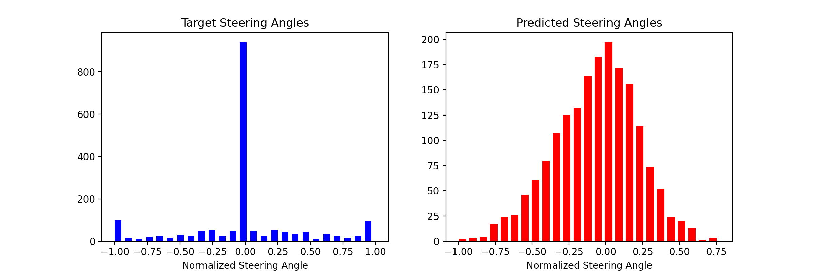
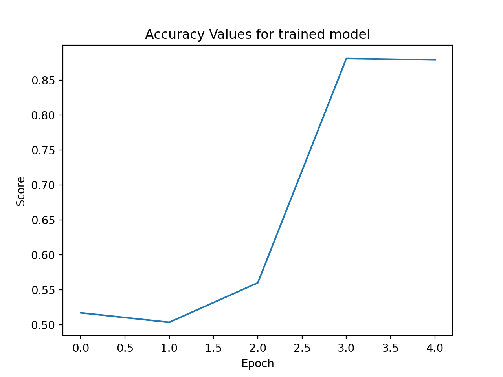
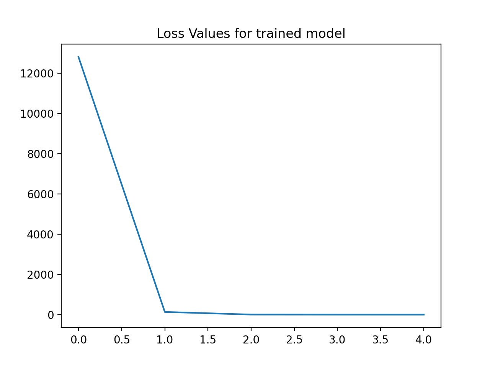

# Self Driving Car Simulator

## Proposition


**Self Driving Car Simulator** is a deep learning neural network project with a mission to emulate human driving behaivior within a simulator
Using collected driving data from the [Udacity Self-Driving Simulator](https://github.com/udacity/self-driving-car-sim), a vehicle is trained 
to autonomously steer itself based on a set of input images. The deep convolutional neural network used performs well with image regression and classification problems. The initial model was inspired by the [NVIDIA](https://developer.nvidia.com/blog/deep-learning-self-driving-cars/) Convolutional Neural Network implemented for their autonomous vehicle.

## Data Collection

- Training data was collected by driving five laps around the simulator track while recording 
    images as well as steering angle.

- The images were taken from three camera angles (center, left, right) at a rate of 
    14 images per second. 


## EDA

### Steering

- Steering angle was normalized to the range of (-1.5,1.5)
- Steering angle data resembles disproportionate data at angle 0 with next most frequent angles being -1.5 and 1.5
- Training data for steering was done using a keyboard which likely caused abrupt changes in angles. If data was collected on joystick, t
    data would transition more smoothly from 0.


### Image Processing

- Images collected were resized and reshaped to a standard size of 66 x 200 pixels with 3 channels
- Images converted from rgb to yuv for better processing in neural network
- For each data point image from center, left or right was randomly chosen and augmented using random flip
    and random translate to gain more usage from data collected
- Image processing took approximately 27,000 data points and converted it to 9000 data points
- After completing an 80% train test split, training data contained 7396 trainable images


## Running the code
**All code is stored in src directory**
- To train the model, simply run
    ```
    python model.py
    ```
- Custom hyperparameters may be specified in the main function of model.py

## Training

- Training the model required taking the processed camera angle and inputting it into a CNN where it was evaluated against the recorded steering angle
    at that given state to produce an error. This error was then placed back into the CNN with backpropagation weight adjustment


- I used a convolulational 2d neural network to train the model
- Started with an initial layer of the size of the input shape, then slowly increased number of filters while decreasing kernal size
- Model used multiple 50% dropout layers for regularization in between the dense layers
- Each layer used an ELU activiation function as it is effective to avoid vanishing gradient while maintaining nonlinearity in the neural network
- Full neural network yielded 250,000 parameters
- I used a data generator to load and train a manageable amount of data for each iteration


## Results

- The predicted steering angle showed a normally distributed like curve compared to the binary output of the target steering angle
- The increased continuity is likely due to treating this as a complete regression problem a classification problem holding multiple weighted classes
    may have been a better fit
- I only had time to collect around 10 minutes of data for this model. With significantly more training data, the model would have likely better predicted the target steering angles


- I used mean squared error to evaluate the loss metrics on the model
- The base model I used assumed zero gradient in steering
- Oddly enough, when running the model for more than 4 epochs, the accuracy dropped linearly





## Moving Forward

- Although assessing the models loss and accuracy metrics gives reasonable insight into model performance, the model must have real world testing to confirm whether it is successful or not
- The next step is to use Udacity's provided drive.py file which uses Flask to communicate the trained model to the autonomous vehicle simulator
- Even with the model showing reasonable loss and accuracy metrics, I would expect it to drive erratically on an unseen testing track
- Once the model can successfully drive a lap around an unseen track, I would like to implement object detection as well
- Object detection may include stop signs, pedestrains, and lanes
- For better training performance, I plan to collect 5x the amount of data with using a joystick instead of a keyboard
- The ultimate ambitious plan is to implement the trained model on a physically marked test track with raspberry pi attached to an RC Car containing 3 cameras.

## Technologies Used
* [Matplotlib](https://matplotlib.org)
* [Pandas](https://pandas.pydata.org)
* [Tensorflow Keras](https://www.tensorflow.org/api_docs/python/tf/keras/Model)
* [OpenCV](https://pypi.org/project/opencv-python/)
* [Flask](https://flask.palletsprojects.com/en/1.1.x/)
* [NumPy](https://numpy.org)
* [Autonomous Vehicle Simulator](https://github.com/udacity/self-driving-car-sim)


### Citations:
1. “End-to-End Deep Learning for Self-Driving Cars.” NVIDIA Developer Blog, 25 Aug. 2020, developer.nvidia.com/blog/deep-learning-self-driving-cars/.


2. Sagar, Abhinav. “How to Train Your Self Driving Car Using Deep Learning.” Medium, Towards Data Science, 26 Nov. 2019, towardsdatascience.com/how-to-train-your-self-driving-car-using-deep-learning-ce8ff76119cb.


3. Udacity. “Udacity/Self-Driving-Car-Sim.” GitHub, github.com/udacity/self-driving-car-sim. 
